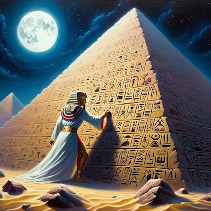

# Graffiti

Graffiti is a Cairo library for building XML based documents - think SVG, HTML, RSS. If it has a `<tag with="attribute">`, you can use Graffiti.



## Usage

The main building block of a XML document is a tag. In Graffiti, it's represented by the `Tag` type:

```rust
let div: Tag = TagImpl::new("div");
```

A tag can have any number of `Attributes` assigned to it:

```rust
let div: Tag = TagImpl::new("div").attr("id", "hero").attr("class", "text-center");
```

A tag element can hold textual content:

```rust
let paragraph: Tag = TagImpl::new("p").content("Lorem ipsum dolor sit amet");
```

XML tags can be combined into a tree to get the desired structure:

```rust
let paragraph: Tag = TagImpl::new("p").content("Lorem ipsum dolor sit amet");
let text: Tag: TagImpl::new("text").insert(p);
let h1: Tag = TagImpl::new("h1").content("Graffiti");
let h2: Tag = TagImpl::new("h2").content("An awesome Cairo lib for building XML documents").
let body: Tag = TagImpl::new("body").insert("h1").insert("h2").insert("text");

// the outcome is the following structure:
// <body><h1>Graffiti</h1><h2>An awesome Cairo lib for building XML documents</h2><text><p>Lorem ipsum dolor sit amet</p></text></body>
```

Note that Graffiti does not place any constraints on the names or values of the tags or attributes. Any text (Cairo's `ByteArray` type) is accepted. In future versions, there might be specific submodules for building HTML or SVG that do some kind of type checking to achieve valid output.

To get the `ByteArray` representation of the document built in Graffiti, call the `build` function on it. Following the example above:

```rust
assert(
    body.build() ==
    "<body><h1>Graffiti</h1><h2>An awesome Cairo lib for building XML documents</h2><text><p>Lorem ipsum dolor sit amet</p></text></body>",
    "Nope"
);
```

### TagBuilder trait

The `TagBuilder` trait is the centerpiece of building documents with Graffiti:

```rust
trait TagBuilder<T> {
    fn new(name: ByteArray) -> T;
    fn build(self: T) -> ByteArray;
    fn attr(self: T, name: ByteArray, value: ByteArray) -> T;
    fn content(self: T, content: ByteArray) -> T;
    fn insert(self: T, child: T) -> T;
}
```

`Tag` implements this trait via `TagImpl`. Import both to use Graffiti:

```rust
use graffiti::{Tag, TagImpl};
```

### Examples

Check the [examples](./examples/) folder to see how to build a minimal HTML page, the Starknet logo in SVG or a single Loot bag using this library.
